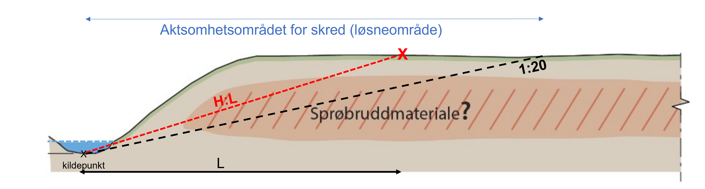

# ArcGIS slope toolbox for evaluating terrain criteria
ArcGIS toolbox for calculating slope with respect to source points as in the terrain criteria in NVE 1/2019 (3.2 step 3).

## Disclaimer

**This is not an official NVE product**. 
This toolbox is under development and may contain errors.  
It is assumed that the user has sufficient understanding of the procedure for assessing terrain criteria in accordance with NVE 1/2019. 
Pay particular attention to:

- Take into account all possible source points where landslides can be initiated. An area can have runouts in several directions!
- Depth to source points must be assessed in each case. Each line can have different depths (ewd).
- The toolbox is intended as an aid for geotechnical assessment - not as a replacement. The user must always use his own judgment.

## Installation

[ArcGIS_slope_toolbox.zip](https://github.com/cgodoyle/ArcGIS_slope_toolbox/files/10698284/ArcGIS_slope_toolbox.zip)  

Download and unzip files.  In ArcGIS Pro, go to the catalog pane and right-click on Toolboxes to add the toolbox.

## Usage
You need to have a DEM (Digital Elevation Model) and a polyline feature class representing the source points.  
The source points must have a field called **ewd** (estimated water depht). Alternatively you can use a point feature class but it should come with the point's elevation as a field ("RASTERVALU") in adition to the ewd field. 

See the toolbox's information dialog next to the inputs for more details.  

#### Recommended symbology for the output:  
4 slope intervals with the following values  
1. 0 -0.05 (<1:20)
2. 0.05-0.067 (1:20-1:15)
3. 0.067-0.2 (1:15-1:5)
4. 0.2-9999 (>1:5)
    

## Citing this tool
There is no publication direclty describing this toolbox, but you may cite this Github repository:  
Godoy, C. (2023): ArcGIS slope toolbox, https://github.com/cgodoyle/Arcgis_slope_toolbox

## Reporting a bug and feedback
If you find a bug, or have any feedback, ideas or comments, please email me at [crgo@nve.no](mailto:crgo@nve.no).

## References
**NVE (2020), Veileder nr. 1/2019**. Sikkerhet mot kvikkleireskred : vurdering av områdestabilitet ved
arealplanlegging og utbygging i områder med kvikkleire og andre jordarter med sprøbruddegenskaper.
https://publikasjoner.nve.no/veileder/2019/veileder2019_01.pdf

